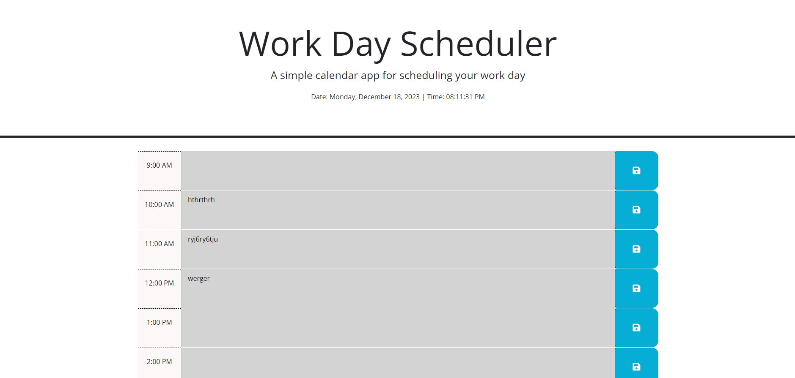

# Hengel Third-party API / Day Planner

## Description:
This application is to assist in planning your day and creates efficency and ease among your busy schedule. The users make comments regarding all upcoming events for the day in your planer, the application is designed with an easy, grey comment fields indicates the past, red indicates the current hour, and green indicates the future hours.. 

## The Challenge:
Create a simple day planner application that includes allows the user to save events to each hour of the day. 

## User Story

AS AN employee with a busy schedule
I WANT to add important events to a daily planner
SO THAT I can manage my time effectively

## Acceptance Criteria

GIVEN I am using a daily planner to create a schedule
WHEN I open the planner
THEN the current day is displayed at the top of the calendar
WHEN I scroll down
THEN I am presented with timeblocks for standard business hours
WHEN I view the timeblocks for that day
THEN each timeblock is color coded to indicate whether it is in the past, present, or future
WHEN I click into a timeblock
THEN I can enter an event
WHEN I click the save button for that timeblock
THEN the text for that event is saved in local storage
WHEN I refresh the page
THEN the saved events persist

## Usage Instructions
1. Open the application on your local device at the beginning of your day - you'll be able to enter any scheduled events/reminders into the planner to keep on you organized.
2. Scroll down to see the breakdown of hours for the current day.
3. Click on the comments to edit the hourly events.
4. Click the save button (on the right) to save the event.
5. Refresh the page to see the changes.
6. Events not saved in comments before refresh won't be tracked locally.

## Screenshots:
### Figure 1. Screenshot

